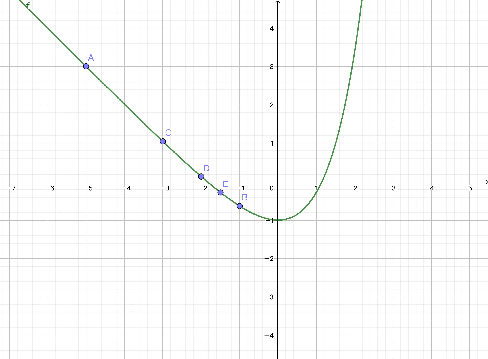
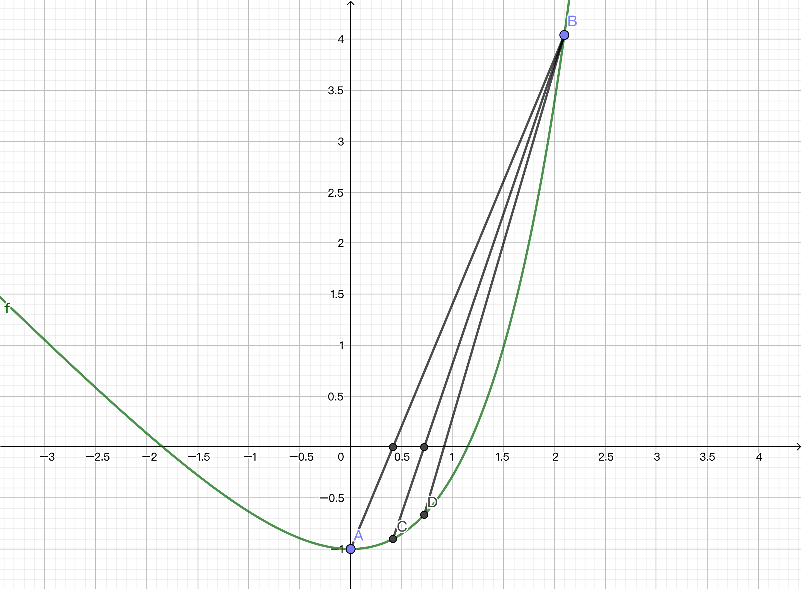

# 定位根的全局收敛法

## 1 波尔查诺二分法

Theorem 1 若$f \in C(a, b)$且存在$r \in [a, b]$ s.t. $f(r) = 0$. 如果$f(a)f(b) < 0$且$c_n$表示波尔查诺二分法中的中点序列，则
$$
|r - c_n| \leq \frac{b - a}{2^{n+1}}\\
\lim_{n \rightarrow\infin} c_n = r
$$
Proof: 
$$
|r - c_n| \leq \frac{b_n - a_n}{2} = \frac{b - a}{2^{n+1}}
$$

## 2 试值法

$$
c_n = b_n - \frac{f(b_n)(b_n - a_n)}{f(b_n) - f(a_n)}
$$

## 3 收敛判定准则

与横坐标有关的收敛判定：
$$
{绝对误差：}|p_n - p_{n-1}| < \delta\\
{相对误差：}\frac{2|p_n - p_{n-1}|}{|p_n| + |p_{n-1}|} < \delta
$$
与纵坐标有关的收敛判定：
$$
|f(p_n)| < \epsilon
$$