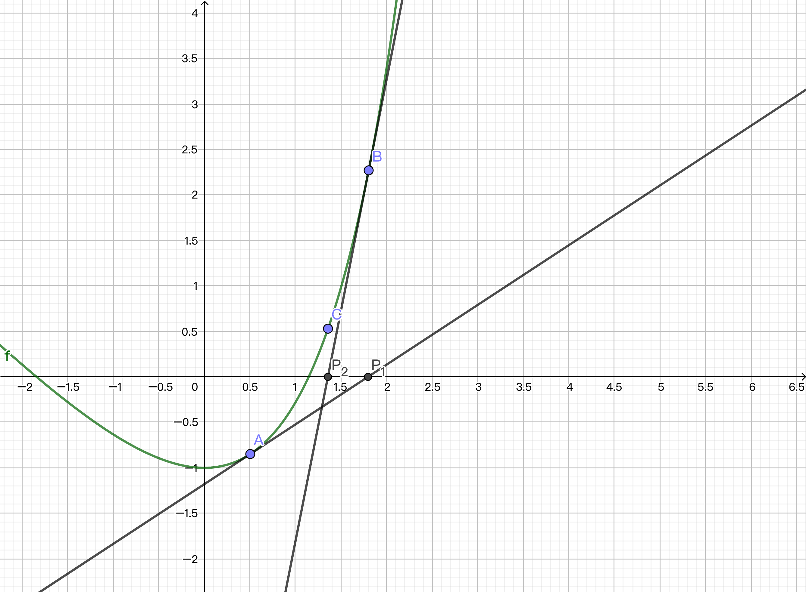
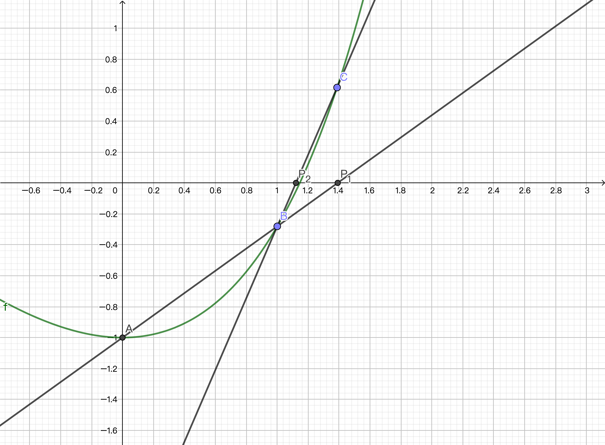

# 定位根的局部收敛法

## 1 初始近似值

波尔查诺二分法与试值法属于全局收敛法，依赖于寻找的区间$[a, b]$，只要$f(a)f(b)<0$，迭代总能找到一个根。

牛顿-拉夫森法和割线法属于局部收敛法，要求给定一个接近根的近似值以保证收敛。

## 2 牛顿-拉夫森法

Theorem 1 设$f \in C^2[a, b]$，且存在数$p \in [a, b]$，满足$f(p)=0$。如果$f\prime(p) ≠ 0$，则存在一个数$\delta > 0$，对任意初始近似值$p_0 \in [p-\delta, p+\delta]$，使得由如下迭代定义的序列$p_n$收敛到$p$：
$$
p_k = g(p_{k-1}) = p_{k-1} - \frac{f(p_{k-1})}{f\prime(p_{k-1})}
$$
其中，函数$g(x) = x - \frac{f(x)}{f\prime(x)}$被称为牛顿-拉夫森迭代函数。由于$f(p)=0$时，$g(p) = p$。牛顿-拉夫森迭代的过程也就是寻找函数$g(p)$不动点的过程。

由此推导出求平方根$\sqrt{A}$的牛顿迭代。此时，
$$
f(x) = x^2 - A, f\prime(x) = 2x, g(x) = \frac{x^2 + A}{2x}
$$
可以证明，对于任意的初始值$p_0 > 0$，迭代将收敛。

Proof：
$$
g\prime(x) = \frac{f(x)f\prime\prime(x)}{(f\prime(x))^2}\\
f(x) = 0 \Leftrightarrow g\prime(x) = 0
$$
由于$f \in C^2[a, b]$，因此能找到$\delta>0$，$x \in (p-\delta, p+\delta)$时，$|g\prime(x)| < 1$.

对于求平方根$\sqrt{A}$的情形，$g\prime(x) = \frac{1}{2}(1 - \frac{A}{x^2}) \in (-1, 1) \Rightarrow x > \sqrt{\frac{A}{3}}$. 但考虑到$p_0 > 0$时，$p_1 = g(p_0) = \frac{x + \frac{A}{x}}{2} \geq \sqrt{A}$，于是对于任意的初始值$p_0 > 0$，迭代将收敛。

Definition 1 设序列$p_n$收敛到$p$，并令$E_n = p - p_n$，若存在$A ≠ 0, R > 0$ s.t. 
$$
\lim_{n \rightarrow \infin}\frac{|E_{n+1}|}{|E_n|^R} = A
$$
则该序列称为以收敛阶$R$收敛到$p$，数$A$为渐进误差常数。

特别的，若$R = 1$，则称序列$p_n$的收敛性为线性收敛；若$R = 2$，则称序列$p_n$的收敛性为二次收敛。

Theorem 2 对于牛顿-拉夫森迭代，

若$p$是单根，则是二次收敛的，且对于足够大的$n$有
$$
|E_{n+1}| \approx \frac{|f\prime\prime(p)|}{2|f\prime(p)|}|E_n|^2
$$
若$p$是$M$阶多重根根，则是线性收敛的，且对于足够大的$n$有
$$
|E_{n+1}| \approx \frac{M-1}{M}|E_n|
$$
Theorem 3 设牛顿-拉夫森算法产生的序列线性收敛到$M$阶多重根根$x=p$，其中$M > 1$，则牛顿-拉夫森迭代公式
$$
p_k = p_{k-1} - \frac{Mf(p_{k-1})}{f\prime(p_{k-1})}
$$
将产生一个二次收敛的序列。

## 3 割线法

$$
p_{k+1} = p_{k} - \frac{f(p_k)(p_k - p_{k-1})}{f(p_k) - f(p_{k-1})}
$$
割线法的收敛阶$R = \frac{1 + \sqrt{5}}{2}$.