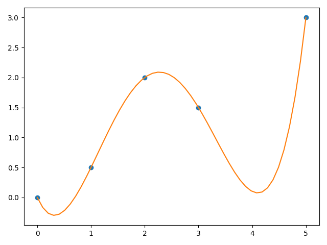
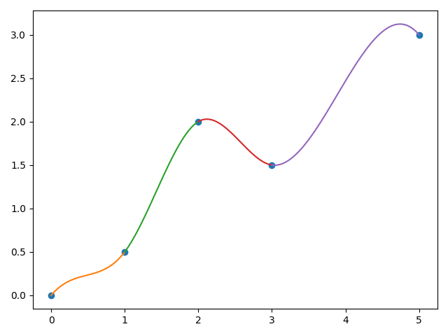
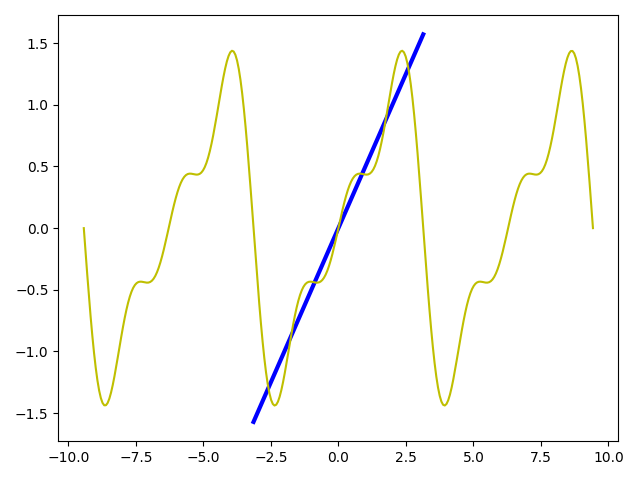

# 数值方法

## 数值方法代码

[非线性方程f(x)=0的解法](Codes/non_linear_equation.py)（包括固定点迭代、二分法、试值法、牛顿-拉夫森迭代与割线法）

[线性方程组AX=B的解法](Codes/linear_equation.py)（包括回代、前代、高斯消元、LU分解、雅可比迭代与高斯-塞尔德迭代）

[函数逼近](Codes/function_approximation.py)（包括拉格朗日逼近与牛顿逼近）

[曲线拟合](Codes/curve_fitting.py)（包括最小二乘拟合、紧压样条曲线、傅立叶级数）

## 数值方法笔记

预备知识

- [预备知识](Notes/[1]预备知识.md)

非线性方程f(x)=0的解法

- [求解x=g(x)的迭代法](Notes/[2]求解x=g(x)的迭代法.md)

- [定位根的全局收敛法](Notes/[3]定位根的全局收敛法.md)

- [定位根的局部收敛法](Notes/[4]定位根的局部收敛法.md)

线性方程组AX=B的解法

- [高斯消元和LU分解法](Notes/[5]求解AX=B的高斯消元和LU分解法.md)

- [迭代法](Notes/[6]求解AX=B的迭代法.md)

插值与逼近

- [函数逼近](Notes/[7]插值与逼近.md)

曲线拟合

- [最小二乘法](Notes/[8]最小二乘法.md)
- [样条函数插值](Notes/[9]样条函数插值.md)
- [傅立叶级数](Notes/[10]傅立叶级数.md)
- [贝塞尔曲线](Notes/[11]贝塞尔曲线.md)

